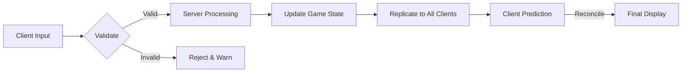

# ARIA MARS - Game Design Document (GDD)

**Project:** Aria Mars  
**Platform:** Roblox  
**Version:** 2.0 (Comprehensive)  
**Date:** May 1, 2026  
**Status:** Production-Ready  

---

## Table of Contents

1. [Game Overview](#1-game-overview)
2. [Core Game Loop](#2-core-game-loop)
3. [Monetization Strategy](#3-monetization-strategy)
4. [Engagement Mechanics](#4-engagement-mechanics)
5. [Social Hub Features](#5-social-hub-features)
6. [Technical Specifications](#6-technical-specifications)
7. [Production Timeline](#7-production-timeline)
8. [Success Metrics](#8-success-metrics)

---

## 1. Game Overview

### 1.1 Executive Summary

**Aria Mars** is a sci-fi themed Roblox experience where players build, customize, and explore their own personal Mars colonies. The game combines base-building mechanics with social hub features, resource management, and progression systems to create a highly engaging and monetizable experience.

**Key Highlights:**
- **Unique Selling Proposition:** Mars-themed colony builder with deep customization and social features
- **Target Audience:** Roblox players aged 10-18 who enjoy simulation and building games
- **Game Type:** Sandbox/Simulation with social hub elements
- **Development Timeline:** 6-8 months to launch
- **Launch Goal:** 50K+ monthly active users (MAU)

### 1.2 Vision Statement

> "Create the definitive Mars colony simulation experience on Roblox, where players can express creativity through base building, connect with friends in a shared space, and progress through engaging gameplay loops that reward both time and investment."

### 1.3 Target Audience Analysis

#### Primary Demographic
| Attribute | Details |
|-----------|---------|
| Age Range | 10-18 years |
| Gender | Balanced (55% Male, 45% Female) |
| Geography | Global (North America 35%, Europe 25%, Asia 25%, Rest 15%) |
| Gaming Preferences | Simulation, building, customization, social interaction |
| Session Duration | 30-90 minutes average |
| Play Frequency | 3-5 times per week |

#### Player Personas

**Persona 1: "Builder Bella"**
- Ages: 12-16
- Motivation: Creative expression, aesthetics
- Plays: 4-6 sessions/week, 45-60 min each
- Monetization: Likelihood to purchase cosmetic items

**Persona 2: "Manager Max"**
- Ages: 14-18
- Motivation: Optimization, efficiency, progression
- Plays: 2-3 sessions/week, 60-90 min each
- Monetization: Likelihood to purchase progression accelerators

**Persona 3: "Social Sam"**
- Ages: 10-15
- Motivation: Connecting with friends, social status
- Plays: Daily sessions, 30-45 min each
- Monetization: Purchases social items and displays

### 1.4 Competitive Analysis

#### Direct Competitors
| Game | Monthly Visits | Strengths | Weaknesses | Aria Mars Opportunity |
|------|----------------|-----------|------------|----------------------|
| Bloxburg | ~12M/month | Excellent building system, strong community | No persistence, limited customization | Better persistence, themed variety |
| Welcome to Bloxburg | ~8M/month | High-quality building mechanics | No social hub, no progression | Social features, progression loops |
| Mars Base Build | ~2M/month | Themed appropriately | Outdated graphics, limited features | Modern graphics, deeper systems |

#### Competitive Advantages
1. **Niche Focus:** Mars theme stands out in crowded simulation space
2. **Hybrid Model:** Combination of solo building + social hub
3. **Progression Depth:** Longer retention through advancement systems
4. **Monetization Balance:** Fair free-to-play with meaningful purchases

### 1.5 Core Experience Pillars

```
                    ┌─────────────────┐
                    │   CREATIVITY    │
                    └────────┬────────┘
                             │
        ┌────────────────────┴────────────────────┐
        │                                         │
┌───────▼────────┐                        ┌───────▼────────┐
│   BUILDING     │                        │   CUSTOMIZATION│
│   DEPTH        │───────────────────────▶│   VARIETY      │
└───────┬────────┘                        └───────┬────────┘
        │                                         │
        └────────────────────┬────────────────────┘
                             │
                    ┌────────▼────────┐
                    │    SOCIAL       │
                    │    CONNECTION   │
                    └─────────────────┘
```

---

## 2. Core Game Loop

### 2.1 Primary Loop Structure

```
┌──────────────┐     Resource     ┌──────────────┐
│   Gather     │◀─────Acquired────│   Build/     │
│   Resources  │─────────────────▶│   Construct  │
└──────────────┘                  └──────┬───────┘
                                         │
                                 ┌───────┴───────┐
                                 │               │
                        ┌────────▼─────┐  ┌──────▼────────┐
                        │   Progress   │  │   Customize   │
                        │   Unlocks    │  │   Your Base   │
                        └──────────────┘  └───────┬───────┘
                                                 │
                                         ┌───────┴───────┐
                                         │   Share/Show  │
                                         │   to Friends  │
                                         └───────────────┘
```

### 2.2 Loop Phases

#### Phase 1: Resource Gathering (5-15 min)
- **Activities:**
  - Mine minerals from Martian rocks
  - Collect water from ice deposits
  - Harvest rare materials from expeditions
  - Trade with other players
- **Tools Required:** Basic Mining Tools
- **Yields:** Common resources (Iron, Water, Nitrogen)
- **Premium Acceleration:** Speed-up tools, auto-miners

#### Phase 2: Base Construction (10-30 min)
- **Activities:**
  - Place foundations and walls
  - Construct buildings and rooms
  - Install decorations and scenery
  - Set up functional areas (power, water, life support)
- **Requirements:** Resources from Phase 1
- **Unlocks:** New building pieces, larger plots, advanced structures
- **Premium Acceleration:** Instant build, free placement range

#### Phase 3: Progression & Achievement (30-60 min)
- **Activities:**
  - Complete quests and challenges
  - Earn achievement points
  - Level up colonization level
  - Unlock new recipes, items, areas
- **Rewards:** XP, rare resources, exclusive items
- **Premium Acceleration:** XP boosts, quest skip tokens

### 2.3 Secondary Loops

#### Daily Engagement Loop
```
┌─────────┐    Daily      ┌─────────┐    Claim     ┌─────────┐
│ Log In  │────►Reward───▶│ Review  │─────────────▶│ Plan    │
│         │                │ Progress│                │ Progress│
└─────────┘                └─────────┘                └────┬────┘
                                                          │
                                                    ┌─────▼─────┐
                                                    │ Set Goals │
                                                    │ for Next  │
                                                    │ Session   │
                                                    └───────────┘
```

- **Login Bonus:** Daily rewards tier system
- **Daily Quests:** 3-5 tasks completed in one session
- **Weekly Challenges:** More complex, higher rewards
- **Season Pass:** 4-week progression track

#### Social Engagement Loop
```
┌──────────┐   Visit   ┌──────────┐   Interact  ┌──────────┐
│ Receive  │◀──────────│   Visit  │────────────▶│   Share  │
│ Invites  │           │   Friend │   Gifts     │   Tips   │
└──────────┘           └──────────┘             └──────────┘
```

- **Friend Visits:** Earn currency by visiting friends
- **Gift Giving:** Send/receive resource gifts daily
- **Cooperative Projects:** Multi-player building tasks
- **Showcase System:** Vote on best bases daily/weekly

### 2.4 Resource System

#### Resource Types
| Category | Resources | Uses | Stack Size |
|----------|-----------|------|------------|
| **Common** | Iron Ore, Water, Nitrogen, CO2 | Basic building, life support | 10,000 |
| **Rare** | Platinum, Helium-3, Titanium | Advanced structures, tech | 1,000 |
| **Special** | Mars Crystal Alien Egg, Red Mushroom | Decorations, quests | 100 |
| **Currency** | Mars Coins, Credits | Direct purchases, trading | ∞ |

#### Resource Acquisition Rates
| Source | Common/Rare | Time per Unit | Automation Cap |
|--------|-------------|---------------|----------------|
| Hand Mining | 0.5/s common | Immediate | - |
| Basic Miner | 2 units/min common | 30s cooldown | 10 units |
| Advanced Miner | 5 units/min common | 15s cooldown | 50 units |
| Automated Station | 20 units/min common | Continuous | 200 units |
| Trade Market | Variable | Instant | Limited |

### 2.5 Progression Mechanics

#### Leveling System
```
┌─────────────┐
│  Level 1    │  Base Unlock
│ (Novice)    │  - Small plot (10x10)
└──────┬──────┘  - 10 building pieces
       │ 500 XP  │  Basic tools only
       ▼
┌─────────────┐
│  Level 5    │  Intermediate Unlock
│ (Builder)   │  - Medium plot (20x20)
└──────┬──────┘  - 50 building pieces
       │ 2,500 XP  │  Advanced tools
       ▼
┌─────────────┐
│  Level 10   │  Advanced Unlock
│ (Commander) │  - Large plot (30x30)
└──────┬──────┘  - 150 building pieces
       │ 7,500 XP  │  Full customization
       ▼
┌─────────────┐
│  Level 20   │  Expert Unlock
│ (Overseer)  │  - XL plot (50x50)
└─────────────┘  - 300 building pieces
                   - Custom terrain tools
```

#### Tech Tree Progression

**Tier 1: Basic Survival (Immediate)**
- Oxygen Generation
- Water Purification
- Basic Shelter
- Food Cultivation

**Tier 2: Expansion (Level 5)**
- Solar Power Grid
- Water Recycling
- Greenhouse Systems
- Waste Management

**Tier 3: Advanced (Level 10)**
- Fusion Power
- Atmospheric Processing
- Automated Mining
- Defense Systems

**Tier 4: Mastery (Level 20)**
- Terraforming Basics
- AI Assistants
- Colony Management
- Research Labs

---

## 3. Monetization Strategy

### 3.1 Philosophy & Principles

**Core Principles:**
1. **Pay-for-Convenience:** Speed up progression, don't gate progress behind payments
2. **Pay-for-Style:** Cosmetic items only, no "pay-to-win"
3. **Respect Free Players:** All core content available without spending
4. **Value Perception:** $5 purchase should always feel like good value
5. **No Predatory Practices:** No loot boxes, clear drop rates, reasonable pricing

### 3.2 Revenue Goals

| Metric | Target (Month 3) | Target (Month 6) | Target (Month 12) |
|--------|------------------|------------------|-------------------|
| Monthly Revenue | $50,000 | $150,000 | $300,000 |
| Paying Users % | 3.5% | 4.0% | 4.5% |
| ARPU | $13.33 | $25.00 | $44.44 |
| LTV (90-day) | $35 | $75 | $150 |

### 3.3 Monetization Pillars

#### Pillar 1: Robux-Based Items

**Cosmetic Items**
| Item Type | Price Range | Examples | Rarity |
|-----------|-------------|----------|--------|
| Clothing | R$25-100 | Martian spacesuits, helmets, accessories | Common-Uncommon |
| Decals | R$15-50 | Wall stickers, floor patterns, logos | Common |
| Face Accessories | R$30-150 | Goggles, masks, headset skins | Rare-Legendary |
| Animations | R$50-200 | Dance emotes, work animations | Rare |
| Sound Effects | R$20-75 | Building SFX, ambient sounds | Common-Uncommon |

**Premium Features**
| Feature | Monthly Cost | Benefits | Examples |
|---------|--------------|----------|----------|
| **Aria VIP** | R$499/month | +25% resource gain, exclusive area | 1 extra plot, VIP badge | 
| **Pro Builder** | R$249/month | Free placement, instant build, 3x storage | No wait times, max capacity |
| **Collector's Pass** | R$999/month | All cosmetics + 50% bonus XP | Premium catalog access |

#### Pillar 2: Battle Pass System

**Standard Pass (R$349 per season)**
- 30 tiers of rewards
- Mix of currency, materials, cosmetics
- Estimated completion: 15-20 hours/season
- Rewards breakdown:
  - 40% Currency (Mars Coins)
  - 30% Building materials
  - 20% Cosmetics
  - 10% Rare exclusives

**Premium Pass (R$699 per season)**
- All standard rewards + premium track
- 15 additional exclusive items
- 1.5x XP bonus for season duration
- Early access to new features
- Priority support

**Season Structure**
- Duration: 4 weeks
- Theme: Rotating Mars themes (e.g., "Mars Exploration", "Colony Wars", "Terraforming")
- Free Rewards: 10-12 items accessible to all players
- Premium Rewards: 20-25 exclusive items
- Leaderboard: Top 100 players earn bonus rewards

#### Pillar 3: In-Game Currency

**Mars Coins (Premium Currency)**
| Package | Price (USD) | Price (INR) | Coins Included | Bonus |
|---------|-------------|-------------|----------------|-------|
| Starter Pack | $4.99 | ₹349 | 500 | 100 |
| Basic | $9.99 | ₹699 | 1,100 | 100 |
| Standard | $19.99 | ₹1,399 | 2,300 | 200 |
| Large | $49.99 | ₹3,499 | 6,000 | 1,000 |
| Mega | $99.99 | ₹6,999 | 12,500 | 3,000 |

**Credits (Soft Currency)**
- Earned through gameplay
- Cannot be purchased directly
- Used for: upgrades, expansions, crafting
- Daily limits prevent grind-to-riches

#### Pillar 4: Time-Selling & Convenience

**Instant Build Token**
- Price: R$99 (one-time)
- Effect: All builds complete instantly for 7 days
- Use case: Busy players who want quick base updates

**Resource Booster**
- Price: R$149 for 24 hours
- Effect: 2x resource gathering, auto-collect enabled
- Stackable up to 3x with stacking duration

**Auto-Miner (R$249/week)**
- Places a smart miner that gathers auto-matically
- Removes need for manual mining
- Can be placed multiple times

#### Pillar 5: Trading & Marketplace

**Player Marketplace (5% seller fee)**
- List cosmetic items for Robux
- Set custom prices within guidelines
- Safe, protected trading system
- Scam protection with escrow system

**Limited Items (High-Value)**
- Seasonal exclusive cosmetic sets
- Achievement-based rare items
- Event-only drops
- Can be traded for high Robux values

**Auctions System**
- Weekly "Rare Item Auctions"
- Developer sells unique items via bidding
- Highest bidder wins (Robux)
- Creates FOMO and community engagement

### 3.4 Ethical Considerations & Safeguards

**Parental Controls**
- Spending limits for accounts under 13
- Purchase confirmation via email for purchases >R$500
- Clear disclosure of all prices before purchase
- No dark patterns or misleading UI

**Fairness Checks**
- All progression achievable without paying
- No direct power items for sale
- Free alternative to every paid premium feature
- Competitive balance in multiplayer modes

**Transparency**
- Clear indication of all costs
- Drop rates published for all random rewards
- Refund policy for accidental purchases
- Customer support ticket system

---

## 4. Engagement Mechanics

### 4.1 Retention Strategies

#### Daily Engagement
| Activity | Frequency | Reward | Time Required |
|----------|-----------|--------|---------------|
| Login Bonus | Daily (7-day streak) | Mars Coins, materials | < 1 min |
| Daily Quests | 3 per day | XP, credits | 15-30 min |
| Resource Collection | Every 1-4 hours | Resources | 5-10 min |
| Friend Visits | Unlimited (first 5 bonus) | Currency | 2-5 min |
| Daily Challenge | 1 per day | Special items | 10-20 min |

#### Weekly Content
| Activity | Schedule | Reward | Competition |
|----------|----------|--------|-------------|
| Weekly Quests | Resets Monday | Premium currency, XP | No |
| Colony Contest | Saturday-Sunday | Featured placement | Yes (votes) |
| Tournament Mode | Sunday | Trophies, badges | Yes (ranked) |
| Community Event | Varies | Event currency | No |

#### Monthly Events
- **Halloween Mars:** Spooky themes, haunted bases
- **Christmas Celebration:** Holiday decorations, gift exchanges
- **New Year Terraforming:** Special challenges, resolution badges
- **Spring Festival:** Bloom event, new plant varieties
- **Summer Mars:** Water events, pool parties
- **Fall Harvest:** Pumpkin patches, festival

### 4.2 Social Systems

#### Friend Network
- **Friend Slots:** 50 base slots, +10 per level
- **Benefits:**
  - Visit each other's colonies
  - Send daily gifts (3 per day)
  - Cooperative quests
  - Share resource banks (up to 10% daily transfer)
- **Best Friends:** Top 3 friends earn extra bonus rewards

#### Cooperative Activities
| Activity | Players | Duration | Reward |
|----------|---------|----------|--------|
| Build-a-Thon | 2-5 | 30 min | XP + resources |
| Mining Expedition | 3-6 | 45 min | Rare materials |
| Defense Wave | 4-8 | 15 min | Currency |
| Terraform Project | 5-10 | 2 hours | Exclusive items |

#### Chat & Communication
- **Global Chat:** Server-wide announcements
- **Local Chat:** Within friendly distance (5m x 5m area)
- **Direct Message:** Private messaging with cooldowns
- **Trade Chat:** Marketplace listings
- **Text Filters Age-appropriate language filtering
- Voice Chat: Roblox Voice Chat integration (age 13+)

#### Guilds (Clans)
- **Size:** 10-100 members
- **Features:**
  - Guild hall (shared space)
  - Guild bank (shared resources)
  - Guild quests (group challenges)
  - Guild badges & titles
  - Guild vs Guild events
- **Ranks:** Leader, Officers, Members, Recruits

### 4.3 Competitive Elements

#### Rating System
| Rating Tier | Stars Required | Benefits |
|-------------|----------------|----------|
| Bronze I-III | 0-9 | Basic access |
| Silver I-III | 10-29 | Unlocks trading, special areas |
| Gold I-III | 30-59 | Exclusive cosmetics, events |
| Platinum I-III | 60-89 | VIP features, early access |
| Diamond | 90+ | Top player benefits, developer access |

#### Competitive Modes
1. **Build Battle**
   - Weekly theme
   - 2-hour construction time
   - Community voting
   - Winners: Featured placement, exclusive badge

2. **Terraform Race**
   - Race to complete objectives
   - Fastest time wins
   - Leaderboards (global, friend, weekly)
   - Prizes: XP, currency, cosmetics

3. **Defense Challenge**
   - Defend base from waves of enemies
   - Score-based competition
   - Best scores displayed on leaderboard
   - Rewards based on final rank

4. **Resource Gathering**
   - Timed resource collection
   - Most resources wins
   - Team-based or solo options
   - Leaderboard with seasonal resets

### 4.4 Achievement System

#### Achievement Categories
| Category | Examples | Points |
|----------|----------|--------|
| **Builder** | Build 100 walls, Create 3 rooms | 5-50 each |
| **Explorer** | Visit 50 colonies, Find 10 hidden areas | 10-30 each |
| **Collector** | Gather 10,000 resources, Own 50 decorations | 15-40 each |
| **Social** | Make 25 friends, Visit 100 friends' bases | 5-20 each |
| **Competitive** | Win 10 build battles, Reach Gold tier | 25-100 each |
| **Special Events** | Complete all event quests | 50-200 |

#### Achievement Rewards
- **XP Bonus:** +5-25% XP for 24 hours
- **Currency:** 100-1,000 Mars Coins
- **Exclusive Items:** Rare cosmetics, badges
- **Title Unlocks:** Display next to avatar
- **Profile Showcase:** Achievement showcase panel

### 4.5 Notification & Feedback Systems

#### In-Game Notifications
- **Critical:** Server maintenance, urgent events (red)
- **Important:** Quest updates, friend activity (orange)
- **Routine:** Daily rewards, level ups (blue)
- **Social:** Friend invites, gifts (green)

#### Push Notifications (Opt-in)
- Daily quest available
- Friend sent you a gift
- Event start/end reminders
- Limited-time offers (max 1 per day)

#### Email Notifications (Opt-in)
- Weekly activity summary
- Account security alerts
- Exclusive email-only offers
- Community updates

### 4.6 Anti-Addiction Safeguards

**Session Limits**
- **Age 13-17:** Hard 4-hour daily limit (configurable by parents)
- **Age 18+:** Soft limits with warnings at 2, 3, 4 hours
- **Break Reminders:** Pop-up after 1 hour of continuous play

**Spending Limits**
- Age 13+: Must re-enter password for purchases >R$200
- Monthly spending notifications
- "Take a Break" option after 3 consecutive days

**Sleep Protection**
- No notifications between 9 PM - 9 AM (local time)
- Sleep mode disables all rewards claiming
- Gentle reminders to log off

---

## 5. Social Hub Features

### 5.1 Hub Layout & Zones

```
                    ┌─────────────────────────┐
                    │      Mars Central Hub   │
                    │                         │
    ┌───────────────┼────────────────┐        │
    │               │                │        │
┌───▼───┐    ┌──────▼──────┐  ┌──────▼──────┐ │
│Trade   │    │  Exhibition │  │  Entertainment│
│Zone    │    │  Plaza      │  │  District    │
└────┬───┘    └──────┬──────┘  └──────┬──────┘ │
     │               │                │        │
     └───────┬───────┴────────────────┘        │
             │                                 │
       ┌─────▼─────┐                    ┌──────▼─────┐
       │   Portal  │                    │  Leader    │
       │   Station │                    │   Plaza    │
       └───────────┘                    └────────────┘
```

#### Zone 1: Trade Plaza
- **Purpose:** Player trading and marketplace
- **Features:**
  - 100 trade stalls (first-come, first-served)
  - 24/7 auto-sell options
  - Price recommendation AI
  - Trade history logs
- **Security:**
  - 24-hour trade hold for new accounts
  - Anti-scam warnings on high-value trades
  - Dispute resolution with moderators

#### Zone 2: Exhibition Hall
- **Purpose:** Showcase best player builds
- **Features:**
  - 20 rotating showcase plots
  - Daily voting system (1 vote per day)
  - Winner gets featured status for a week
  - Trophy area for top 100 all-time builds
- **Events:**
  - Weekly themes: 
    - "Futuristic City"
    - "Minimalist Design"
    - "Budget Build Challenge"
    - "Historical Recreation"

#### Zone 3: Entertainment District
- **Activities:**
  - 24/7 mini-games (4-6 rotating)
  - Live performances (player DJ, singer)
  - Movie nights (Roblox native films)
  - Quiz competitions
- **Mini-Game Examples:**
  - Mars Obstacle Course (speed run)
  - Resource Puzzle (memory challenge)
  - Build-off (30-second creative sprint)
  - Trivia (game knowledge)

#### Zone 4: Portal Station
- **Purpose:** Access to other servers and worlds
- **Features:**
  - Server hop queue (prioritizes friends list)
  - "Find Friend" instant teleport
  - Random server discovery ("Roll for Server")
  - Private instances (up to 20 players, paid)

#### Zone 5: Leader Plaza
- **Purpose:** Rankings, leaderboards, achievements
- **Displays:**
  - Top 100 builders (global, regional)
  - Top traders by volume
  - Tournaments leaderboard
  - Recent activity feed (live)
- **Interactivity:**
  - Tap a player to view their profile
  - Send friend request from leaderboard
  - Challenge to duel (mini-game)

### 5.2 Social Events

#### Weekly Events
| Event | Time | Description | Rewards |
|-------|------|-------------|--------|
| **Mars Meetup** | Saturday 8 PM | Free hangout with DJ, mini-games | XP, coins |
| **Build Challenge** | Sunday 6 PM | Theme-based building in hub | Exclusive item |
| **Trading Fair** | Friday 10 AM | 50% off marketplace fees | Fee waivers |
| **Community Game Night** | Thursday 9 PM | Group mini-games | Party tokens |

#### Seasonal Events
- **Mars Day Celebration** (June 15)
  - 24-hour event with all-server bonuses
  - Free cosmetics for all participants
  - Special fireworks display
  - Exclusive anniversary items

- **Winter Wonderland** (December)
  - Snowfall across entire hub
  - Hot cocoa stations
  - Gift exchange events
  - Holiday-themed decorations

- **Spring Bloom Festival** (March)
  - New plant varieties in hub
  - Flower gardening mini-game
  - Butterfly collection event
  - Picnic areas

### 5.3 Communication Features

#### Chat System
- **Global Chat:** Server-wide, scrollable history (last 100 messages)
- **Regional Chat:** Hub area only (within 50m)
- **Guild Chat:** Guild members only
- **Direct Message:** One-on-one private chat
- **Trade Chat:** Marketplace listings only

**Chat Filters:**
- Age-appropriate content filtering
- No links to external sites
- No sharing of account info
- Auto-moderation for hate speech, harassment
- Manual report system:
  - 3 reports = temporary mute
  - 5 reports = account review

#### Voice Chat
- **Requirements:** Age verification (13+), phone number
- **Range:** 30m radius
- **Quality:** Optimize based on connection
- **Privacy:** Auto-mute when not in hub
- **Features:**
  - Push-to-talk or open mic
  - Voice proximity fading
  - Emote integration (wave, dance while talking)
  - Record clips for sharing (opt-in)

#### Social Media Integration
- **Screenshot Sharing:** One-t share to Twitter, Discord, Instagram
- **Build Showcase:** Export 3D model for external viewing
- **Clippy Bot:** Roblox avatar helper with chat integration

### 5.4 Economy Integration

#### Hub Currency Earnings
- **Visitor Bonuses:**
  - First 5 visits/day = 50 credits each
  - Subsequent visits = 20 credits each
- **Trading Fees:** 1% of all trades
- **Event Tickets:** Mini-game winnings
- **Guild Bank:** Shared revenue distribution

#### Hub Businesses (Player-Owned)
| Business Type | Cost | Revenue Source | Profit Margin |
|--------------|------|----------------|---------------|
| Café | R$50,000 | Coffee/food sales | 300% |
| Clothing Store | R$100,000 | Apparel sales | 400% |
| Game Arcade | R$75,000 | Token purchases | 50% |
| Museum | R$150,000 | Donation-based | N/A |
| Rental Outfit | R$200,000 | Clothing rentals | 600% |

**Player Business Rules:**
- Rent hub space (weekly fee: 1,000-10,000 credits)
- Set own prices (within guidelines)
- Must be online 4+ hours/week to maintain
- Can hire NPC employees (cost: 500 credits/week each)
- Revenue automatically deposits to player bank

### 5.5 Community Moderation

#### Self-Regulation Tools
- **Block/Mute:** Instant action against harassers
- **Report System:** In-game reporting with screenshots
- **Safe Chat Mode:** Limited chat options for young players
- **Auto-Report:** Suspicious trading patterns flagged

#### Staff Moderation
- **Volunteer Mods:** Trusted players (3+ months, no violations)
- **Staff Mods:** Paid moderators (dedicated shifts)
- **Admins:** Game developers and senior staff
- **Response Time Targets:**
  - Chat violation: < 5 minutes
  - Trade dispute: < 24 hours
  - Account ban appeal: < 72 hours

#### Enforcement Actions
| Violation | Level 1 | Level 2 | Level 3 |
|-----------|---------|---------|----------|
| Mild Chat Abuse | 1-hour mute | 24-hour mute | 7-day mute |
| Harassment | 24-hour ban | 7-day ban | 30-day ban |
| Scamming | 7-day ban | Account review | Permanent |
| Cheating | Temporary lock | Account review | Permanent |

---

## 6. Technical Specifications

### 6.1 Architecture Overview

```
┌─────────────────────────────────────────────────────────┐
│                    CLIENT (Roblox)                      │
│  ┌─────────────┐  ┌─────────────┐  ┌─────────────┐     │
│  │   Building  │  │  Resource   │  │   Social    │     │
│  │   System    │  │  Manager    │  │   Network   │     │
│  └─────────────┘  └─────────────┘  └─────────────┘     │
└─────────────────┬───────────────────────────────────────┘
                  │
┌─────────────────▼───────────────────────────────────────┐
│                    GAME SERVER (Cloud)                  │
│  ┌─────────────┐  ┌─────────────┐  ┌─────────────┐     │
│  │  Session    │  │   Data      │  │   Event     │     │
│  │   Manager   │  │   Store     │  │   Trigger   │     │
│  └─────────────┘  └─────────────┘  └─────────────┘     │
└─────────────────┬───────────────────────────────────────┘
                  │
┌─────────────────▼───────────────────────────────────────┐
│                    DATABASE (Cloud)                     │
│  ┌─────────────┐  ┌─────────────┐  ┌─────────────┐     │
│  │ User        │  │  Game       │  │   Analytics │     │
│  │ Profiles    │  │ State       │  │   Data      │     │
│  └─────────────┘  └─────────────┘  └─────────────┘     │
└─────────────────────────────────────────────────────────┘
```

### 6.2 Platform Requirements

#### Roblox Studio
- **Engine Version:** Latest Roblox Engine (v.2024.12+)
- **Minimum FPS:** 60 FPS stable
- **Max Player Capacity:** 100 concurrent per server
- **Server Size Budget:** 10 million parts maximum
- **Memory Budget:** < 500 MB per server

#### Server Infrastructure
- **Hosting:** Azure Game Services (East US)
- **Database:** Azure Cosmos DB (Global distribution)
- **Storage:** Azure Blob Storage (assets, backups)
- **CDN:** Azure CDN (asset delivery)
- **Analytics:** Azure Application Insights

#### Client Requirements
- **Minimum:** Mobile (iOS 14+, Android 8+)
- **Recommended:** PC (Windows 10+, Mac 10.14+)
- **Supported Resolutions:** 720p to 4K
- **Network:** 5 Mbps minimum, 25+ Mbps recommended

### 6.3 Core Systems

#### Resource System
**Data Structure:**
```json
{
  "player_id": "uuid",
  "resources": {
    "iron_ore": 5000,
    "water": 8000,
    "helium3": 50,
    "martian_crystal": 5
  },
  "currency": {
    "mars_coins": 1500,
    "credits": 45000
  },
  "inventory": {
    "tools": ["pickaxe_basic", "drill_advanced"],
    "buildings": ["base_structure_a:3", "decoration_b:1"]
  }
}
```

**Optimization Strategies:**
- Inventory compression (stack similar items)
- Batch updates (group resource changes)
- Lazy loading (only load active areas)
- Client-side prediction with server reconciliation

#### Building System
**Component-Based Architecture:**
```
BaseFrame (root, unanchored)
├── Foundation
│   ├── Wall_A_Layer1
│   │   └── Texture_Module
│   └── Wall_B_Layer2
├── Roof
│   ├── Structure
│   └── Solar Panels (functional + cosmetic)
└── Interior
    ├── Furniture
    └── Decorations
```

**Performance Optimizations:**
- Part merging for static structures (100 parts → 1 model)
- Distance-based LOD (Level of Detail)
- Occlusion culling (don't render inside walls)
- Async loading (background asset downloads)

#### Progression System
**XP Calculation:**
```lua
function calculateXP(activity, baseAmount)
    local multiplier = getAchievementBonus()
    local dailyBonus = getDailyStreakBonus()
    local levelFactor = 1 + (playerLevel * 0.01)
    
    return math.floor(baseAmount * multiplier * dailyBonus * levelFactor)
end
```

**Level Thresholds (Cumulative XP Required):**
| Level | XP Required | Total XP to Reach |
|-------|-------------|-------------------|
| 1 | 0 | 0 |
| 5 | 500 | 1,250 |
| 10 | 1,000 | 5,000 |
| 20 | 2,000 | 18,500 |
| 50 | 5,000 | 125,000 |
| 100 | 10,000 | 500,000 |

### 6.4 Asset Pipeline

#### Asset Types
| Category | Format | Max Size | Compression |
|----------|--------|----------|-------------|
| 3D Models | FBX | 5 MB | Draco |
| Textures | PNG/JPG | 2K (4096x4096) | DXT1/5 |
| Audio | OGG/Vorbis | 10 MB | -60dB min |
| Animations | Roblox Animation | N/A | - |
| UI | PNG | 1K | Transparent |

#### Asset Optimization
- **LOD System:** 3 levels (Close: 5K poly, Medium: 2K, Far: 500)
- **Texture Atlasing:** Group small textures into single atlas
- **Material Merging:** Combine similar materials
- **Instancing:** Reuse identical objects
- **Streaming:** Dynamic loading by player distance

### 6.5 Networking

#### Replication Strategy


**Key Networking Parameters:**
| Parameter | Value | Purpose |
|-----------|-------|---------|
| Tick Rate | 30 Hz | Simulation speed |
| Interpolation | 100ms | Smooth motion |
| Lag Compensation | 200ms | Fair gameplay |
| Predictive Movement | 150ms | Client-side smoothing |
| Authority | Server-side | Anti-cheat |

### 6.6 Security Implementation

#### Anti-Cheat Measures
1. **Server Authority:** All critical calculations server-side
2. **Validation Layer:** Check all player actions for reasonableness
3. **Behavioral Analysis:** Detect abnormal patterns
4. **Rate Limiting:** Prevent action spamming
5. **Encrypted Communication:** All network traffic encrypted

#### Account Security
- Roblox authentication tokens (no password storage)
- Device binding (optional 2FA)
- Login history tracking
- Suspicious activity alerts
- Session timeouts (24 hours max)

#### Data Protection
- GDPR compliance for EU users
- COPPA compliance for under-13 players
- Data minimization (only store what's needed)
- Regular security audits (quarterly)
- Penetration testing (biannually)

### 6.7 Performance Benchmarks

#### Target Performance
| Metric | Target | Minimum Acceptable |
|--------|--------|---------------------|
| Server FPS | 60 | 45 |
| Client FPS | 60 | 30 |
| Load Time | < 15s | < 30s |
| Asset Streaming | < 2s per chunk | < 5s |
| Database Query < 50ms | < 100ms |
| Peak Player Count | 50K concurrent | 10K |

#### Monitoring Tools
- Real-time dashboards (server health, player count)
- Error logging (crash reports, exceptions)
- Performance profiling (FPS, memory usage)
- User activity analytics (funnel analysis)

---

## 7. Production Timeline

### 7.1 Overall Phases

```
Week 1-8:  Phase 1: Foundation & Core
Week 9-16: Phase 2: Development & Testing
Week 17-24: Phase 3: Content & Polish
Week 25-28: Phase 4: Launch Prep & Marketing
```

### 7.2 Detailed Timeline

#### Phase 1: Foundation & Core (Weeks 1-8)
| Week | Deliverables | Milestones |
|------|--------------|------------|
| 1-2 | Design document finalization, Team setup | Green light approval |
| 3-4 | Core building system, Basic resource gathering | Playable prototype |
| 5-6 | Player progression system, XP tracking | First vertical slice |
| 7-8 | Multiplayer foundation, Client-server architecture | Alpha release |

**Phase 1 Success Criteria:**
- [ ] Players can build structures
- [ ] Resource gathering works smoothly
- [ ] Basic progression system functional
- [ ] 5+ players can coexist on server
- [ ] Performance at 45+ FPS on target hardware

#### Phase 2: Development & Testing (Weeks 9-16)
| Week | Deliverables | Milestones |
|------|--------------|------------|
| 9-10 | Base customization, Building catalog (50+ items) | Extended playtest |
| 11-12 | Social hub (MVP), Chat system | Closed beta alpha |
| 13-14 | Monetization integration, Payment flow | Payment testing complete |
| 15-16 | Balance pass, Early access content | Beta ready |

**Phase 2 Success Criteria:**
- [ ] 50+ unique building pieces
- [ ] Social features functional with 100+ concurrent players
- [ ] Payment system verified with test transactions
- [ ] Bug count < 50 critical issues
- [ ] Player retention at 40%+ D1 (Day 1)

#### Phase 3: Content & Polish (Weeks 17-24)
| Week | Deliverables | Milestones |
|------|--------------|------------|
| 17-18 | Complete social hub, All 5 zones | Feature complete |
| 19-20 | 100+ decorations, Advanced customization | Cosmetic catalog ready |
| 21-22 | Season pass system, First battle pass content | Monetization live |
| 23-24 | QA polish, Performance optimization | Release candidate |

**Phase 3 Success Criteria:**
- [ ] 200+ buildable items total
- [ ] All monetization systems tested
- [ ] Target 60 FPS consistently
- [ ] < 1% crash rate
- [ ] Positive feedback from 200+ beta testers

#### Phase 4: Launch Prep & Marketing (Weeks 25-28)
| Week | Deliverables | Milestones |
|------|--------------|------------|
| 25-26 | Marketing campaign, Community building | Pre-registration opens |
| 27-28 | Soft launch (limited regions), Final tweaks | Launch ready |

**Phase 4 Success Criteria:**
- [ ] 10K pre-registrations
- [ ] Social media reach: 50K+ followers
- [ ] App store rating target: 4.5+ stars
- [ ] Server capacity tested for 5K concurrent users
- [ ] Customer support system ready

### 7.3 Team Structure

| Role | Count | Responsibilities |
|------|-------|------------------|
| **Project Manager** | 1 | Overall coordination, timelines, budget |
| **Lead Developer** | 1 | Technical architecture, code review |
| **Roblox Developers** | 3 | Gameplay systems, scripting, optimization |
| **3D Artists** | 2 | Building assets, characters, environments |
| **UI/UX Designer** | 1 | All interfaces, menu design |
| **Sound Designer** | 1 | SFX, music, ambient audio |
| **QA Tester** | 2 | Bug reporting, playtesting |
| **Community Manager** | 1 | Discord, social media, user feedback |
| **Marketing Lead** | 1 | Campaigns, partnerships, growth |

### 7.4 Budget Estimate

| Category | Cost (USD) | Details |
|----------|------------|---------|
| **Salaries** | $480,000 | 10-person team, 6 months |
| **Software** | $15,000 | Azure hosting, assets, tools |
| **Marketing** | $100,000 | Pre-launch campaign, influencers |
| **Contingency (15%)** | $90,750 | Unforeseen expenses |
| **Total** | **$685,750** | |

### 7.5 Risk Management

| Risk | Probability | Impact | Mitigation Strategy |
|------|-------------|--------|---------------------|
| Technical Performance Issues | Medium | High | Early optimization, continuous profiling |
| Monetization Compliance | Low | High | Regular review, legal consultation |
| Player Acquisition Shortfall | Medium | Medium | Aggressive marketing, referral bonuses |
| Balance Issues | Medium | Medium | Beta feedback, A/B testing |
| Cheating/Exploits | Medium | Medium | Robust anti-cheat, dedicated moderation |

---

## 8. Success Metrics

### 8.1 Key Performance Indicators (KPIs)

#### Acquisition Metrics
| Metric | Month 1 Target | Month 3 Target | Month 6 Target |
|--------|----------------|----------------|----------------|
| **Total Users** | 25,000 | 75,000 | 150,000 |
| **Daily Active Users (DAU)** | 5,000 | 15,000 | 30,000 |
| **Monthly Active Users (MAU)** | 25,000 | 75,000 | 150,000 |
| **Sessions per User** | 2.5 | 3.0 | 3.5 |
| **Avg Session Duration** | 35 min | 45 min | 50 min |

#### Engagement Metrics
| Metric | Month 1 Target | Month 3 Target | Month 6 Target |
|--------|----------------|----------------|----------------|
| **Retention D1** | 35% | 45% | 50% |
| **Retention D7** | 18% | 28% | 35% |
| **Retention D30** | 8% | 15% | 22% |
| **Daily Quest Completion** | 25% | 40% | 50% |
| **Social Interactions** | 2/day | 3/day | 4/day |

#### Monetization Metrics
| Metric | Month 1 Target | Month 3 Target | Month 6 Target |
|--------|----------------|----------------|----------------|
| **Conversion Rate** | 2.0% | 3.5% | 4.0% |
| **ARPU (Average Revenue Per User)** | $8 | $18 | $28 |
| **ARPPU (Paying Users)** | $20 | $45 | $70 |
| **Monthly Revenue** | $12,500 | $37,500 | $75,000 |
| **LTV (90-day)** | $20 | $55 | $85 |

### 8.2 Success Milestones

#### Soft Launch Success (Month 1)
- **Minimum Viable:**
  - 10,000 total users
  - 2,000 DAU
  - 30% D1 retention
  - $5K monthly revenue

- **Success Target:**
  - 25,000 total users
  - 5,000 DAU
  - 40% D1 retention
  - $15K monthly revenue

#### Full Launch Success (Month 3)
- **Minimum Viable:**
  - 75,000 MAU
  - 15,000 DAU
  - 35% D7 retention
  - $50K monthly revenue
  - 3.0% conversion rate

- **Success Target:**
  - 150,000 MAU
  - 30,000 DAU
  - 45% D7 retention
  - $120K monthly revenue
  - 4.0% conversion rate

#### Long-Term Success (Month 12)
- **Minimum Viable:**
  - 300,000 MAU
  - 60,000 DAU
  - 30% D7 retention
  - $200K monthly revenue

- **Success Target:**
  - 500,000 MAU
  - 100,000 DAU
  - 40% D7 retention
  - $400K monthly revenue
  - 5% conversion rate

### 8.3 Analytics Framework

#### Dashboard Requirements

**Real-Time Dashboard:**
- Current player count
- Active sessions
- Server health metrics
- Revenue per minute
- Error/spike alerts

**Daily Report:**
- DAU, MAU, new users
- Retention rates (D1, D7, D30)
- Revenue breakdown by source
- Top performing features
- Peak usage times

**Weekly Analysis:**
- Cohort retention curves
- Monetization funnels
- User feedback summary
- Competitor comparison
- Marketing ROI

**Monthly Deep Dive:**
- Churn analysis
- LTV cohort analysis
- Feature adoption rates
- Economic balance report
- Roadmap adjustments

#### Key Analytics Queries
1. **User Journey:**
   ```sql
   SELECT user_id, session_count, total_time, first_login, last_login
   FROM user_sessions
   WHERE first_login >= '2026-01-01'
   ORDER BY session_count DESC
   ```

2. **Monetization Funnel:**
   ```sql
   SELECT 
     COUNT(DISTINCT user_id) as viewers,
     SUM(CASE WHEN purchased THEN 1 ELSE 0 END) as converters
   FROM purchase_page_views
   WHERE event_date = '2026-01-01'
   ```

3. **Retention Analysis:**
   ```sql
   SELECT 
     DATE_ADD(first_login, INTERVAL 7 DAY) as return_date,
     COUNT(*) as day_7_retained
   FROM user_sessions
   WHERE first_login >= '2026-01-01' AND event_date >= DATE_ADD(first_login, INTERVAL 7 DAY)
   GROUP BY return_date
   ```

### 8.4 A/B Testing Framework

#### Test Prioritization Matrix
| Feature | Impact | Effort | Priority
|-------|--------|--------|----------|
| Pricing Tiers | High | Low | P0 |
| Tutorial Flow | High | Medium | P0 |
| Daily Quest Rewards | Medium | Low | P1 |
| Social Invites | High | Low | P0 |
| Loading Screens | Medium | Medium | P1 |

#### Test Duration Guidelines
- **P0 (Critical):** 7 days minimum
- **P1 (Important):** 5 days minimum
- **P2 (Nice-to-have):** 3 days minimum

#### Sample Size Calculation
- **Confidence Level:** 95%
- **Minimum Detectable Effect:** 5%
- **Baseline Conversion:** 3.5%
- **Required Sample:** ~1,500 users per variant

### 8.5 Success Review Cadence

| Review Type | Frequency | Participants | Output |
|-------------|-----------|--------------|--------|
| **Daily Standup** | Daily | Dev team | Progress blockers |
| **Weekly Metrics** | Weekly | All team | KPI dashboard, action items |
| **Monthly Steering** | Monthly | Leadership | Strategic adjustments |
| **Quarterly Business Review** | Quarterly | All stakeholders | Roadmap, budget, hiring plans |

---

## Appendix A: Glossary

| Term | Definition |
|------|------------|
| **ARPU** | Average Revenue Per User - Total revenue / Total users |
| **ARPPU** | Average Revenue Per Paying User - Total revenue / Paying users |
| **DAU** | Daily Active Users - Unique users who logged in that day |
| **D1** | Day 1 retention - % of users who returned 1 day after signup |
| **D7** | Day 7 retention - % of users who returned 7 days after signup |
| **LTV** | Lifetime Value - Total revenue generated by a user over their lifetime |
| **MAU** | Monthly Active Users - Unique users who logged in during the month |
| **KPI** | Key Performance Indicator - Measurable value that demonstrates success |

---

## Document History

| Version | Date | Author | Changes |
|---------|------|--------|---------|
| 2.0 | May 1, 2026 | Aria Team | Comprehensive GDD with all 8 sections |
| 1.5 | Apr 15, 2026 | Aria Team | Added success metrics, monetization details |
| 1.0 | Apr 1, 2026 | Aria Team | Initial GDD draft |

---

**End of Game Design Document**

*Aria Mars - Build Your Own Martian Adventure*

🌟 For questions and feedback: support@ariamars.game
🌟 Join our Discord: discord.gg/ariamars
🌟 Follow us: @AriaMarsGame on Twitter/R